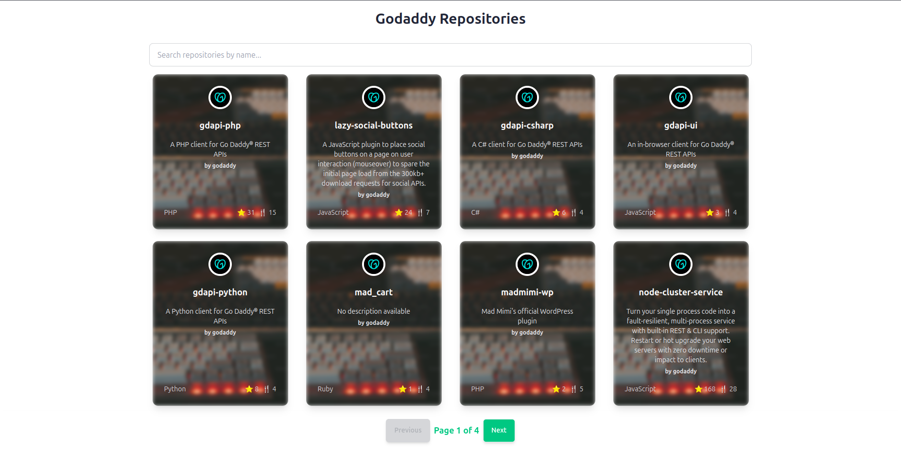

# Godaddy Repositories Viewer

A React-based application that fetches and displays repositories from the Godaddy GitHub organization. The app allows users to browse repositories, view details such as title, description, language(s), forks, open issues, and watchers, and visit the GitHub page for each repository.

---

## Features

- Fetches data from [GitHub's API](https://api.github.com/orgs/godaddy/repos).
- Displays a searchable list of repositories.
- Detailed view for each repository, including:
  - Repository name
  - Description
  - Primary language
  - Number of forks
  - Number of open issues
  - Number of watchers
  - Link to the repository page
- Responsive and styled using **Daisy UI** (built on Tailwind CSS).
- Loading skeletons for better user experience.
- Error handling for API failures.

---

## Demo




---

## Installation

1. Clone the repository:
   ```bash
   git clone https://github.com/your-username/godaddy-repos-viewer.git
   cd godaddy-repos-viewer

2. Install dependencies:
   ```bash
   npm install

3. Start the development server:
   ```bash
   npm run dev

4. Open your browser and navigate to:
   ```arduino
   http://localhost:5173
   


---


## Project Structure
 ```plaintext
 src/
├── components/        # React components
│   ├── RepoList.jsx   # Displays the list of repositories
│   ├── RepoDetails.jsx # Displays details of a specific repository
├── App.jsx            # Main app with routing
├── main.jsx           # Entry point of the application
├── index.css          # Tailwind and Daisy UI styles
```


---

## Technologies Used

- React: Front-end JavaScript library.
- Vite: Fast development build tool.
- React Router: For navigation between pages.
- Axios: HTTP client for API calls.
- Tailwind CSS & Daisy UI: For styling and UI components.


---


> **Note:** 60 requests per hour per IP address.


